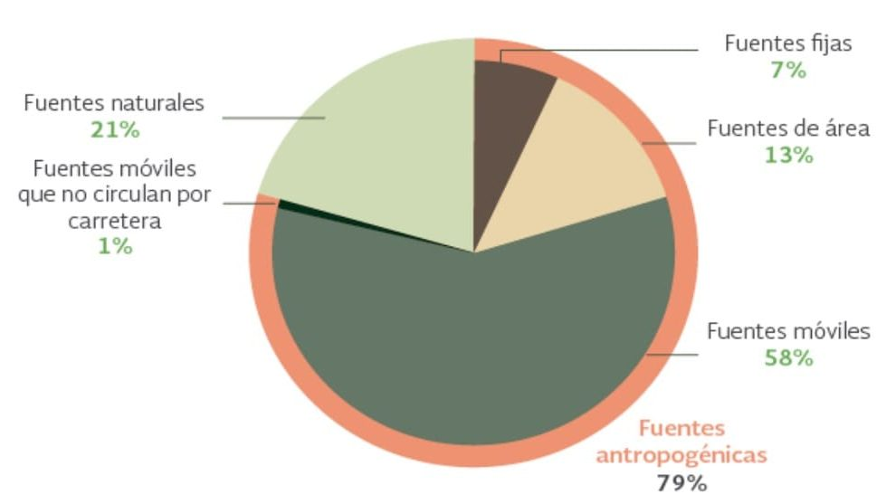
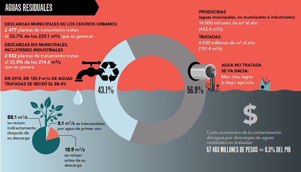
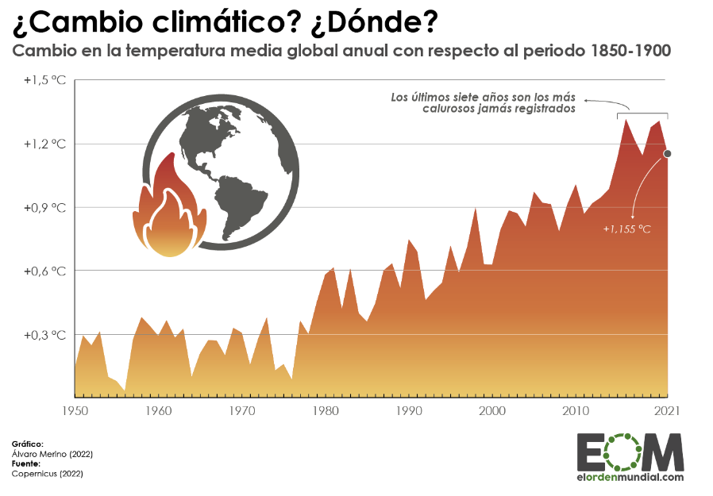
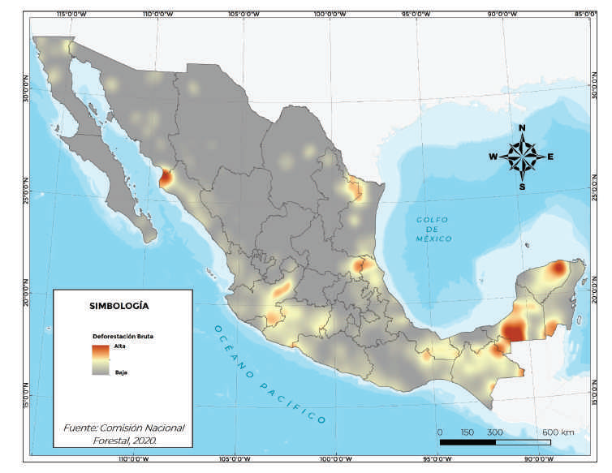
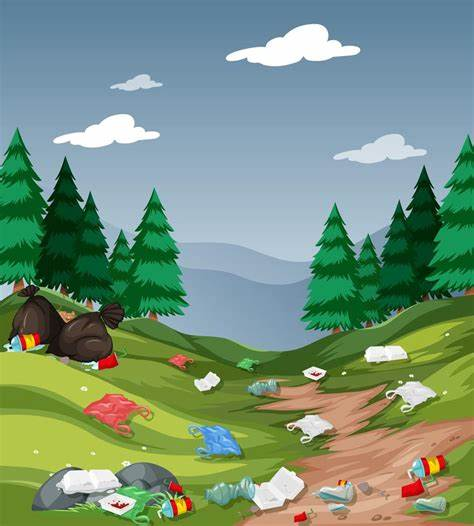
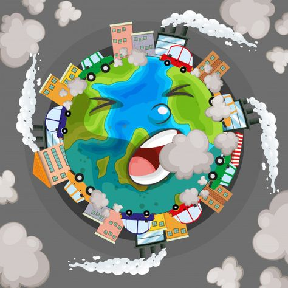
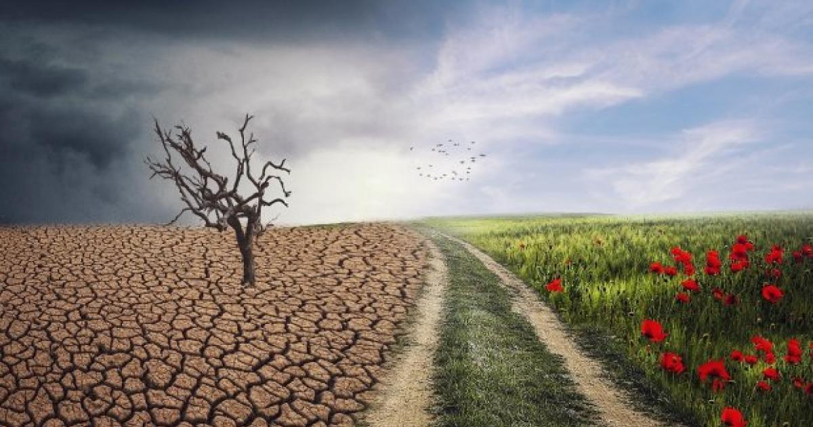
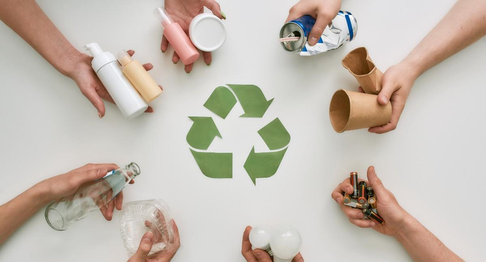

# EcoNet
<html lang="es">
<head>
    <meta charset="UTF-8">
    <meta name="viewport" content="width=device-width, initial-scale=1.0">
    <title>Problemas Ambientales</title>
    
    <link href="https://fonts.googleapis.com/css2?family=Poppins:wght@400;600&display=swap" rel="stylesheet">
</head>
<body>

<header>
    <h1>🌎 Problemas Ambientales</h1>
    
<strong>Materia:</strong> Cultura digital 2 | <strong>Equipo:</strong> Luis Ortiz, Jocelyn Camacho, Ingrid Ascencio, Miranda Alejo, Yaritza Martinez, Vania Aguilar, Perla Zapata | <strong>Fecha:</strong> 29 de Abril

</header>

<nav>
    <a href="#introduccion">Introducción</a>
    <a href="#objetivos">Objetivos</a>
    <a href="#metodologia">Metodología</a>
    <a href="#resultados">Resultados</a>
    <a href="#causas">Causas</a>
    <a href="#soluciones">Soluciones</a>
    <a href="#conclusiones">Conclusiones</a>
</nav>

<section>
    <h2>Introducción</h2>
    
Durante los últimos siglos, el desarrollo industrial, el crecimiento poblacional y el excesivo consumo de los recursos ha provocado un profundo deterioro ambiental. La explotación intensiva de la naturaleza ha superado su capacidad para regenerarse, generando así una crisis ecológica que impacta todos los aspectos de la vida en la Tierra. 

Los problemas ambientales son una amenaza seria, no solo para la biodiversidad y los ecosistemas, sino también para el bienestar, la seguridad alimentaria y la salud de los seres humanos. La degradación del medio ambiente ha alcanzado un punto crítico, donde los fenómenos como el cambio climático, la escasez de agua y la pérdida de la biodiversidad afectan la estabilidad global. 

Por ello, este proyecto tiene como finalidad analizar las principales problemáticas ambientales que enfrenta nuestro planeta, sus causas, consecuencias y las alternativas de solución más viables que permitan la transición hacia un modelo sostenible de desarrollo. 

</section>

<section>
    <h2>Objetivos de la Investigación</h2>
    <ul>
        <li>Identificar los principales problemas ambientales actuales en el contexto global y local.</li>
        <li>Analizar las causas humanas y naturales que intensifican estas problemáticas.</li>
        <li>Proponer soluciones sustentables basadas en la educación, la innovación tecnológica y la cooperación internacional.</li>
    </ul>
</section>

<section>
    <h2>Metodología</h2>
    
Se realizó una recolección de información mediante artículos científicos recientes, reportes oficiales de organismos internacionales como la ONU, OMS, PNUMA y Greenpeace, además de bases de datos confiables como el IPCC. 
 También se consultaron fuentes digitales actualizadas, incluyendo sitios web especializados en medio ambiente y bases de datos electrónicas. 
 La metodología incluyó el análisis de casos actuales emblemáticos (como los incendios en el Amazonas y la contaminación del río Ganges) y la selección de gráficos y estadísticas digitales para ilustrar visualmente la magnitud del problema. 

</section>
<section>
    <h2>Principales problemas ambientales</h2>

    <section>
        <h3>Contaminación del Aire</h3>
        
Uno de los mayores desafíos actuales es la contaminación del aire, causada principalmente por el transporte motorizado, las industrias pesadas y la quema de combustibles fósiles. Se estima que cerca de 7 millones de personas mueren anualmente debido a enfermedades relacionadas con la mala calidad del aire. 

De acuerdo con las cifras de SEMARNAT, para el año 2013 las fuentes antropogénicas emiten el mayor porcentaje de contaminación en México con un 79%, dejando a las naturales con el 21% restante como se muestra en la figura 1; por otra parte, las principales fuentes antropogénicas son las Móviles (formas de transporte y vehículos motorizados) con un 58% del total de emisiones.

        
    </section>

    <section>
        <h3>Contaminación del Agua</h3>
        
La contaminación del agua es igualmente alarmante: el 80% de las aguas residuales se vierte sin tratamiento adecuado al medio ambiente. Esto no solo afecta a los ecosistemas acuáticos, sino que compromete la disponibilidad de agua potable para millones de personas. 

Cada año, millones de metros cúbicos de aguas residuales mal tratadas o sin tratamiento contaminan los cuerpos de agua, afectando ecosistemas y salud. Es necesario reducir los volúmenes y mejorar los procesos de tratamiento por razones sociales, ambientales, económicas y de seguridad nacional. En México, el 52.7% de las aguas residuales municipales y el 32% de las no municipales son tratadas.

          
    </section>

    <section>
        <h3>Cambio Climático</h3>
        
Respecto al cambio climático, el planeta ha experimentado un aumento de temperatura de 1.2 °C en promedio desde la era preindustrial, intensificando fenómenos meteorológicos extremos como olas de calor, inundaciones y sequías prolongadas. 

        
    </section>

    <section>
        <h3>Deforestación</h3>
        
La deforestación continúa siendo crítica: según datos del PNUMA, se pierden aproximadamente 10 millones de hectáreas de bosques cada año, especialmente en regiones como el Amazonas y el sudeste asiático. 

Las principales causas directas de la Deforestación abarcan los cambios de uso de suelo derivados de la expansión de la frontera agrícola y pecuaria, así como la expansión urbana, industriales turísticos los cuales impactan directamente la cubierta forestal, por otro lado, existen causas subyacentes (o indirectas) asociadas principalmente a la aplicación de políticas públicas de desarrollo rural que han fomentado la sustitución de la cobertura forestal. 

Paralelamente, la Degradación es un proceso que se relaciona principalmente con las presiones de usuarios locales cuyo uso de los recursos rebasa la capacidad de carga y de regeneración de los bosques debido, por ejemplo, a la tala selectiva, el sobrepastoreo, la expansión e intensificación de las prácticas de agricultura rotatoria y a la extracción de leña, madera, postes y otros productos forestales. 

Se estima que en el periodo 2001-2018 en México se perdieron en promedio 212,070 ha al año de bosques y selvas. 

        
    </section>

    <section>
        <h3>Otros Problemas Ambientales</h3>
        <ul>
            <li>Contaminación del suelo: pérdida de fertilidad agrícola, afectando la producción de alimentos. </li>
            <li>Pérdida de biodiversidad: según la ONU, un millón de especies están actualmente en peligro de extinción. </li>
            <li>Contaminación acústica y lumínica: alteración de ecosistemas urbanos y rurales, afectando ciclos de sueño y migración animal. </li>
        </ul>
        
    </section>

<section id="causas">
    <h2>Causas Principales</h2>
    <ul>
        <li>Industrialización masiva sin regulaciones ambientales</li>
        <li>Modelos de consumo insostenibles</li>
        <li>Falta de educación ambiental</li>
        <li>Debilidad en políticas gubernamentales</li>
    </ul>
    
</section>

<section id="consecuencias">
    <h2>Consecuencias a Corto y Largo Plazo</h2>
    <ul>
        <li>Salud humana: incremento de enfermedades como asma y cáncer.</li>
        <li>Ecosistemas: pérdida de biodiversidad y servicios ecosistémicos.</li>
        <li>Economía: daños a infraestructuras, pérdidas agrícolas y turísticas.</li>
        <li>Sociedad: desplazamientos climáticos y conflictos por recursos.</li>
    </ul>
    
</section>

<section id="soluciones">
    <h2>Soluciones Propuestas</h2>
    <ul>
        <li>Fomentar la educación ambiental</li>
        <li>Impulsar el uso de energías renovables</li>
        <li>Implementar legislación ambiental estricta</li>
        <li>Promover la economía circular</li>
        <li>Reforestar áreas degradadas</li>
        <li>Innovar en tecnologías limpias</li>
    </ul>
    
</section>

<section id="conclusiones">
    <h2>Conclusiones</h2>
    
El deterioro ambiental no es un fenómeno aislado ni algo reciente; es la suma de decisiones insostenibles tomadas durante muchas décadas. Sin embargo, estamos a tiempo de revertir muchos de sus efectos. La protección del medio ambiente requiere de un esfuerzo colectivo donde cada individuo, organización y gobierno asuma su responsabilidad. Adoptar estilos de vida sostenibles, fomentar la innovación verde, y fortalecer las políticas públicas son pasos cruciales para garantizar un futuro saludable y justo para las próximas generaciones. El momento de actuar es ahora.

</section>

<section>
    <h2>Bibliografía</h2>
    <ul>
        <li>Programa de las Naciones Unidas para el Medio Ambiente (PNUMA). (2024).</li>
        <li>Organización Mundial de la Salud (OMS). (2024).</li>
        <li>Greenpeace Internacional. (2024).</li>
        <li>Panel Intergubernamental sobre Cambio Climático (IPCC). (2023).</li>
        <li>Banco Mundial. (2024).</li>
        <li><a href="http://aire.org.mx/el-aire/" target="_blank">aire.org.mx</a></li>
        <li><a href="https://agua.org.mx/agua-contaminacion-en-mexico/" target="_blank">agua.org.mx</a></li>
        <li><a href="https://sis.cnf.gob.mx/deforestacion-y-degradacion-forestal/" target="_blank">sis.cnf.gob.mx</a></li>
    </ul>
</section>

<footer>
    
© 2025 Proyecto Ambiental. Todos los derechos reservados.

</footer>

<button id="btnTop" onclick="window.scrollTo({ top: 0, behavior: 'smooth' });">⬆️</button>
